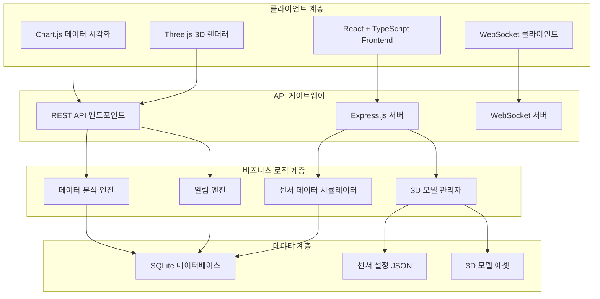
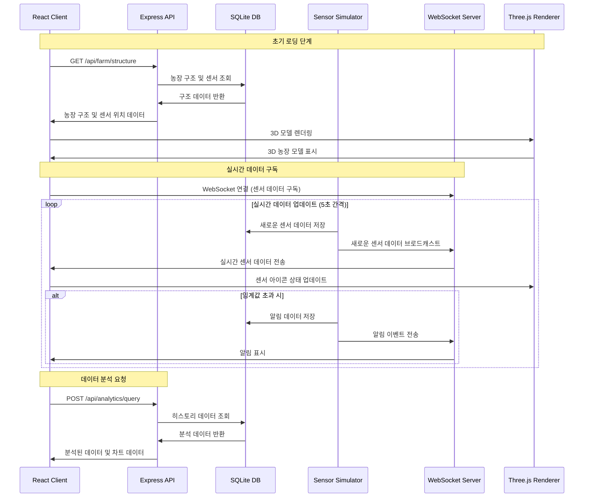
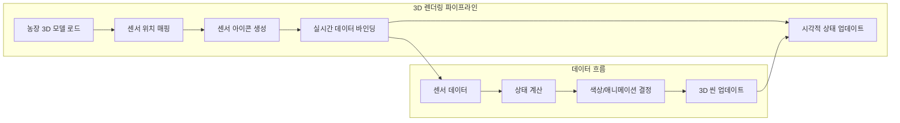

# AgriTwin 시스템 아키텍처 설계서

## 프로젝트 개요

**AgriTwin**은 도심형 스마트 농장을 위한 디지털 트윈 시스템입니다. 다층 구조의 수직농장을 3D로 시각화하고, 실시간 센서 데이터를 모니터링하며, 데이터 분석을 통해 농장 운영을 최적화하는 것을 목표로 합니다.

### 주요 기능
- 🏢 다층 구조 수직농장 3D 모델링
- 📊 실시간 센서 데이터 모니터링 (기온, 습도, 토양수분, 조도, CO2 등)
- 📈 데이터 시각화 및 분석
- 🔔 임계값 기반 알림 시스템
- 📱 반응형 웹 인터페이스

## 1. 전체 시스템 아키텍처



### 아키텍처 특징
- **계층화된 구조**: 프레젠테이션, 비즈니스 로직, 데이터 계층 분리
- **실시간 통신**: WebSocket을 통한 양방향 실시간 데이터 전송
- **모듈화 설계**: 각 기능별 독립적인 모듈로 구성
- **파일 기반 DB**: SQLite를 사용한 경량 데이터 저장소

## 2. 프로젝트 폴더 구조

```
agritwin/
├── package.json
├── README.md
├── .gitignore
├── tsconfig.json
├── vite.config.ts
├── server/                     # 백엔드 서버
│   ├── src/
│   │   ├── index.ts           # 서버 진입점
│   │   ├── config/            # 설정
│   │   │   ├── database.ts    # DB 연결 설정
│   │   │   └── constants.ts
│   │   ├── database/          # 데이터베이스
│   │   │   ├── migrations/    # DB 마이그레이션
│   │   │   ├── models/        # ORM 모델
│   │   │   │   ├── Sensor.ts
│   │   │   │   ├── SensorData.ts
│   │   │   │   ├── FarmZone.ts
│   │   │   │   └── Alert.ts
│   │   │   └── seeders/       # 초기 데이터
│   │   ├── routes/            # API 라우트
│   │   │   ├── sensors.ts
│   │   │   ├── models.ts
│   │   │   ├── analytics.ts
│   │   │   └── zones.ts
│   │   ├── services/          # 비즈니스 로직
│   │   │   ├── SensorSimulator.ts
│   │   │   ├── DataAnalyzer.ts
│   │   │   ├── ModelManager.ts
│   │   │   └── AlertService.ts
│   │   ├── utils/
│   │   │   ├── logger.ts
│   │   │   └── validators.ts
│   │   └── websocket/
│   │       └── socketHandlers.ts
│   ├── data/                  # 정적 데이터
│   │   ├── farm-config.json   # 농장 구조 설정
│   │   ├── sensor-types.json  # 센서 타입 정의
│   │   └── agritwin.db        # SQLite 데이터베이스 (자동 생성)
│   └── package.json
├── client/                    # 프론트엔드
│   ├── src/
│   │   ├── main.tsx          # React 진입점
│   │   ├── App.tsx
│   │   ├── components/       # React 컴포넌트
│   │   │   ├── common/
│   │   │   │   ├── Header.tsx
│   │   │   │   ├── Sidebar.tsx
│   │   │   │   ├── Loading.tsx
│   │   │   │   └── Modal.tsx
│   │   │   ├── three/        # 3D 관련 컴포넌트
│   │   │   │   ├── FarmViewer.tsx
│   │   │   │   ├── SensorIcon.tsx
│   │   │   │   ├── ZoneHighlight.tsx
│   │   │   │   └── ModelLoader.tsx
│   │   │   ├── dashboard/    # 대시보드
│   │   │   │   ├── SensorPanel.tsx
│   │   │   │   ├── ChartSection.tsx
│   │   │   │   ├── StatCard.tsx
│   │   │   │   └── AlertPanel.tsx
│   │   │   └── controls/     # 제어 패널
│   │   │       ├── ZoneSelector.tsx
│   │   │       ├── TimeRange.tsx
│   │   │       └── SensorFilter.tsx
│   │   ├── hooks/            # React 훅
│   │   │   ├── useWebSocket.ts
│   │   │   ├── useSensorData.ts
│   │   │   ├── useThreeJS.ts
│   │   │   └── useLocalStorage.ts
│   │   ├── services/         # API 서비스
│   │   │   ├── api.ts
│   │   │   └── websocket.ts
│   │   ├── types/            # TypeScript 타입
│   │   │   ├── sensor.types.ts
│   │   │   ├── farm.types.ts
│   │   │   ├── chart.types.ts
│   │   │   └── api.types.ts
│   │   ├── utils/
│   │   │   ├── constants.ts
│   │   │   ├── formatters.ts
│   │   │   └── calculations.ts
│   │   └── styles/           # 스타일
│   │       ├── globals.css
│   │       ├── variables.css
│   │       └── components/
│   ├── public/
│   │   ├── models/           # 3D 모델 파일
│   │   │   ├── farm-structure.glb
│   │   │   ├── sensors/
│   │   │   │   ├── temperature.glb
│   │   │   │   ├── humidity.glb
│   │   │   │   └── soil-moisture.glb
│   │   │   └── plants/
│   │   ├── textures/
│   │   └── icons/
│   ├── package.json
│   └── vite.config.ts
└── docs/                     # 문서
    ├── architecture.md       # 이 문서
    ├── api.md               # API 문서
    ├── database.md          # 데이터베이스 스키마
    └── deployment.md        # 배포 가이드
```

## 3. 데이터베이스 설계 (SQLite)

### 3.1 데이터베이스 설정

SQLite는 파일 기반 데이터베이스로 별도 설치 없이 사용 가능하며, 데이터베이스 파일이 없으면 자동으로 생성됩니다.

**설정 파일 (`server/src/config/database.ts`)**:
```typescript
import sqlite3 from 'sqlite3';
import { open } from 'sqlite';
import path from 'path';

export async function initializeDatabase() {
  const dbPath = path.join(__dirname, '../../data/agritwin.db');
  
  const db = await open({
    filename: dbPath,
    driver: sqlite3.Database
  });

  // 테이블이 없으면 자동 생성
  await createTables(db);
  await seedInitialData(db);
  
  return db;
}
```

### 3.2 데이터베이스 스키마

```sql
-- 농장 구역 테이블
CREATE TABLE farm_zones (
  id TEXT PRIMARY KEY,
  name TEXT NOT NULL,
  level INTEGER NOT NULL,
  area REAL NOT NULL,
  crop_type TEXT,
  position_x REAL,
  position_y REAL,
  position_z REAL,
  size_x REAL,
  size_y REAL,
  size_z REAL,
  created_at DATETIME DEFAULT CURRENT_TIMESTAMP
);

-- 센서 테이블
CREATE TABLE sensors (
  id TEXT PRIMARY KEY,
  name TEXT NOT NULL,
  type TEXT NOT NULL,
  zone_id TEXT,
  position_x REAL,
  position_y REAL,
  position_z REAL,
  min_normal REAL,
  max_normal REAL,
  min_warning REAL,
  max_warning REAL,
  min_critical REAL,
  max_critical REAL,
  is_active BOOLEAN DEFAULT 1,
  created_at DATETIME DEFAULT CURRENT_TIMESTAMP,
  FOREIGN KEY (zone_id) REFERENCES farm_zones (id)
);

-- 센서 데이터 테이블
CREATE TABLE sensor_data (
  id INTEGER PRIMARY KEY AUTOINCREMENT,
  sensor_id TEXT NOT NULL,
  value REAL NOT NULL,
  unit TEXT NOT NULL,
  status TEXT CHECK(status IN ('normal', 'warning', 'critical')),
  timestamp DATETIME DEFAULT CURRENT_TIMESTAMP,
  FOREIGN KEY (sensor_id) REFERENCES sensors (id)
);

-- 알림 테이블
CREATE TABLE alerts (
  id INTEGER PRIMARY KEY AUTOINCREMENT,
  sensor_id TEXT NOT NULL,
  message TEXT NOT NULL,
  severity TEXT CHECK(severity IN ('info', 'warning', 'critical')),
  is_resolved BOOLEAN DEFAULT 0,
  created_at DATETIME DEFAULT CURRENT_TIMESTAMP,
  resolved_at DATETIME,
  FOREIGN KEY (sensor_id) REFERENCES sensors (id)
);

-- 시스템 설정 테이블
CREATE TABLE system_settings (
  key TEXT PRIMARY KEY,
  value TEXT NOT NULL,
  description TEXT,
  updated_at DATETIME DEFAULT CURRENT_TIMESTAMP
);
```

### 3.3 초기 데이터 시딩

```typescript
async function seedInitialData(db: Database) {
  // 농장 구역 생성 (3층 수직농장)
  const zones = [
    { id: 'zone-1-1', name: '1층 A구역', level: 1, area: 25.0, crop_type: '상추' },
    { id: 'zone-1-2', name: '1층 B구역', level: 1, area: 25.0, crop_type: '시금치' },
    { id: 'zone-2-1', name: '2층 A구역', level: 2, area: 25.0, crop_type: '케일' },
    { id: 'zone-2-2', name: '2층 B구역', level: 2, area: 25.0, crop_type: '루꼴라' },
    { id: 'zone-3-1', name: '3층 A구역', level: 3, area: 25.0, crop_type: '바질' },
    { id: 'zone-3-2', name: '3층 B구역', level: 3, area: 25.0, crop_type: '민트' }
  ];

  // 센서 생성 (각 구역당 5개 센서)
  const sensorTypes = ['temperature', 'humidity', 'soil_moisture', 'light', 'co2'];
  
  for (const zone of zones) {
    for (const sensorType of sensorTypes) {
      await db.run(`
        INSERT INTO sensors (id, name, type, zone_id, is_active)
        VALUES (?, ?, ?, ?, ?)
      `, [
        `${zone.id}-${sensorType}`,
        `${zone.name} ${sensorType} 센서`,
        sensorType,
        zone.id,
        1
      ]);
    }
  }
}
```

## 4. 모듈 간 상호작용 방식



## 5. API 설계

### 5.1 REST API 엔드포인트

#### 농장 구조 관련
```typescript
GET    /api/farm/structure          // 전체 농장 구조 조회
GET    /api/farm/zones             // 구역 목록 조회
GET    /api/farm/zones/:id         // 특정 구역 상세 조회
PUT    /api/farm/zones/:id         // 구역 정보 업데이트

// 응답 예시
{
  "id": "farm-001",
  "name": "AgriTwin 수직농장",
  "totalLevels": 3,
  "dimensions": { "x": 10, "y": 15, "z": 8 },
  "zones": [
    {
      "id": "zone-1-1",
      "name": "1층 A구역",
      "level": 1,
      "area": 25.0,
      "cropType": "상추",
      "sensors": [...]
    }
  ]
}
```

#### 센서 관련
```typescript
GET    /api/sensors                    // 전체 센서 목록
GET    /api/sensors/:id                // 특정 센서 상세 정보
GET    /api/sensors/:id/data           // 센서 데이터 히스토리
      ?start=2024-01-01&end=2024-01-02&limit=100
POST   /api/sensors/:id/calibrate      // 센서 캘리브레이션
PUT    /api/sensors/:id/ranges         // 임계값 범위 업데이트

// 센서 데이터 응답 예시
{
  "sensor": {
    "id": "zone-1-1-temperature",
    "name": "1층 A구역 온도 센서",
    "type": "temperature",
    "unit": "°C",
    "position": { "x": 2.5, "y": 3.0, "z": 1.5 }
  },
  "data": [
    {
      "id": 1001,
      "value": 23.5,
      "status": "normal",
      "timestamp": "2024-01-01T10:00:00Z"
    }
  ]
}
```

#### 데이터 분석
```typescript
GET    /api/analytics/summary          // 요약 통계
POST   /api/analytics/query            // 커스텀 쿼리
GET    /api/analytics/alerts           // 알림 목록
GET    /api/analytics/trends           // 트렌드 분석

// 요약 통계 응답 예시
{
  "summary": {
    "totalSensors": 30,
    "activeSensors": 28,
    "alertCount": 3,
    "averageTemperature": 24.2,
    "averageHumidity": 65.8
  },
  "zoneStats": [
    {
      "zoneId": "zone-1-1",
      "sensorCount": 5,
      "avgTemperature": 23.5,
      "status": "normal"
    }
  ]
}
```

### 5.2 WebSocket 이벤트

#### 클라이언트 → 서버
```typescript
'subscribe:sensor-data'     // 모든 센서 데이터 구독
'subscribe:zone'           // 특정 구역 구독
'subscribe:alerts'         // 알림 구독
'unsubscribe:all'         // 모든 구독 해제
```

#### 서버 → 클라이언트
```typescript
'sensor-data:update'       // 실시간 센서 데이터
'sensor:alert'            // 센서 알림
'system:status'           // 시스템 상태 업데이트
'zone:update'             // 구역 정보 업데이트

// 이벤트 데이터 예시
{
  "event": "sensor-data:update",
  "data": {
    "sensorId": "zone-1-1-temperature",
    "value": 25.3,
    "status": "warning",
    "timestamp": "2024-01-01T10:05:00Z",
    "zone": "zone-1-1"
  }
}
```

## 6. 3D 모델과 센서 데이터 연동

### 6.1 3D 렌더링 파이프라인



### 6.2 센서 시각화 규칙

#### 상태별 시각적 표현
- **정상 상태** (normal): 
  - 색상: 녹색 (#4CAF50)
  - 애니메이션: 부드러운 펄스 (2초 주기)
  - 투명도: 80%

- **경고 상태** (warning):
  - 색상: 주황색 (#FF9800)
  - 애니메이션: 중간 속도 깜빡임 (1초 주기)
  - 투명도: 90%

- **위험 상태** (critical):
  - 색상: 빨간색 (#F44336)
  - 애니메이션: 빠른 깜빡임 (0.5초 주기)
  - 투명도: 100%

#### 센서 타입별 아이콘
```typescript
const sensorIcons = {
  temperature: '🌡️',
  humidity: '💧',
  soil_moisture: '🌱',
  light: '💡',
  co2: '🫧'
};
```

### 6.3 상호작용 기능

#### 센서 클릭 이벤트
```typescript
function handleSensorClick(sensorId: string) {
  // 1. 센서 상세 정보 패널 표시
  showSensorDetailPanel(sensorId);
  
  // 2. 해당 센서 하이라이트
  highlightSensor(sensorId);
  
  // 3. 최근 데이터 차트 표시
  loadSensorChart(sensorId);
}
```

#### 구역 선택 기능
```typescript
function selectZone(zoneId: string) {
  // 1. 해당 구역의 모든 센서 하이라이트
  highlightZoneSensors(zoneId);
  
  // 2. 카메라 포커스를 해당 구역으로 이동
  focusCameraOnZone(zoneId);
  
  // 3. 구역 통계 패널 표시
  showZoneStats(zoneId);
}
```

#### 시간 조작 기능
```typescript
function setTimeRange(startDate: Date, endDate: Date) {
  // 1. 히스토리 데이터 로드
  const historicalData = await loadHistoricalData(startDate, endDate);
  
  // 2. 센서 상태를 과거 데이터로 업데이트
  updateSensorsWithHistoricalData(historicalData);
  
  // 3. 타임라인 슬라이더 표시
  showTimelineSlider(startDate, endDate);
}
```

## 7. UI/UX 디자인 가이드라인

### 7.1 디자인 원칙
- **미니멀리즘**: 불필요한 요소 제거, 핵심 정보에 집중
- **일관성**: 색상, 타이포그래피, 간격의 일관된 사용
- **접근성**: WCAG 2.1 AA 수준 준수
- **반응성**: 모바일부터 데스크톱까지 최적화

### 7.2 색상 팔레트
```css
:root {
  /* Primary Colors */
  --color-primary: #2E7D32;      /* 농장 녹색 */
  --color-secondary: #1976D2;    /* 기술 블루 */
  
  /* Status Colors */
  --color-success: #4CAF50;      /* 정상 */
  --color-warning: #FF9800;      /* 경고 */
  --color-error: #F44336;        /* 위험 */
  --color-info: #2196F3;         /* 정보 */
  
  /* Neutral Colors */
  --color-gray-50: #FAFAFA;
  --color-gray-100: #F5F5F5;
  --color-gray-200: #EEEEEE;
  --color-gray-300: #E0E0E0;
  --color-gray-400: #BDBDBD;
  --color-gray-500: #9E9E9E;
  --color-gray-600: #757575;
  --color-gray-700: #616161;
  --color-gray-800: #424242;
  --color-gray-900: #212121;
  
  /* Background */
  --bg-primary: #FFFFFF;
  --bg-secondary: #F8F9FA;
  --bg-dark: #1A1A1A;
}
```

### 7.3 레이아웃 구조
```
┌─────────────────────────────────────────────────────────┐
│ Header (고정)                                            │
├─────────────────────────────────────────────────────────┤
│ Sidebar │                                               │
│ (접이식) │            3D Farm Viewer                    │
│         │                                               │
│ - 구역선택 │                                               │
│ - 센서필터 │                                               │
│ - 시간범위 │                                               │
│         │                                               │
├─────────┼─────────────────────────────────────────────┤
│ 알림패널   │           Dashboard Charts                 │
│         │                                               │
│         │  ┌──────┐ ┌──────┐ ┌──────┐ ┌──────┐         │
│         │  │온도차트│ │습도차트│ │토양차트│ │조도차트│         │
│         │  └──────┘ └──────┘ └──────┘ └──────┘         │
└─────────┴─────────────────────────────────────────────┘
```

## 8. 확장성 및 성능 고려사항

### 8.1 모듈화 설계 원칙

#### 플러그인 아키텍처
```typescript
// 새로운 센서 타입 추가 예시
interface SensorPlugin {
  type: string;
  name: string;
  unit: string;
  ranges: SensorRanges;
  simulate(): number;
  render3D(): THREE.Object3D;
}

class SensorRegistry {
  private plugins: Map<string, SensorPlugin> = new Map();
  
  register(plugin: SensorPlugin) {
    this.plugins.set(plugin.type, plugin);
  }
  
  getPlugin(type: string): SensorPlugin | undefined {
    return this.plugins.get(type);
  }
}
```

#### 상태 관리 (Zustand 사용)
```typescript
interface AppState {
  // 농장 데이터
  farmStructure: FarmStructure | null;
  sensors: Sensor[];
  sensorData: Map<string, SensorData[]>;
  
  // UI 상태
  selectedZone: string | null;
  selectedSensor: string | null;
  timeRange: [Date, Date];
  
  // 액션
  setSelectedZone: (zoneId: string | null) => void;
  updateSensorData: (data: SensorData) => void;
  setTimeRange: (range: [Date, Date]) => void;
}
```

### 8.2 성능 최적화 전략

#### 1. 데이터 최적화
- **페이지네이션**: 대량 센서 데이터 분할 로딩
- **캐싱**: Redis 또는 메모리 캐시를 통한 자주 요청되는 데이터 캐싱
- **데이터 압축**: WebSocket을 통한 데이터 전송 시 압축 적용

#### 2. 3D 렌더링 최적화
- **LOD (Level of Detail)**: 카메라 거리에 따른 모델 디테일 조절
- **인스턴싱**: 동일한 센서 모델의 인스턴스 렌더링
- **프러스텀 컬링**: 화면 밖 오브젝트 렌더링 제외

#### 3. 프론트엔드 최적화
- **가상화**: 대량 리스트 렌더링 시 react-window 사용
- **메모이제이션**: React.memo, useMemo, useCallback 적극 활용
- **코드 스플리팅**: 라우트별 지연 로딩

### 8.3 확장 시나리오

#### 시나리오 1: 농장 규모 확장
- 구역 수: 6개 → 50개
- 센서 수: 30개 → 500개
- 대응 방안:
  - 데이터베이스 인덱싱 최적화
  - 구역별 데이터 파티셔닝
  - 3D 모델 LOD 시스템 강화

#### 시나리오 2: 새로운 센서 타입 추가
- pH 센서, 영양분 센서, 해충 감지 센서 등
- 대응 방안:
  - 플러그인 시스템 활용
  - 동적 UI 컴포넌트 로딩
  - 센서별 전용 시각화 위젯

#### 시나리오 3: 다중 농장 지원
- 단일 농장 → 다중 농장 관리
- 대응 방안:
  - 농장별 데이터 격리
  - 권한 관리 시스템 도입
  - 농장 선택 UI 추가

## 9. 기술 스택 세부사항

### 9.1 백엔드 기술 스택
```json
{
  "runtime": "Node.js 18+",
  "framework": "Express.js 4.18+",
  "language": "TypeScript 5.0+",
  "database": "SQLite 3.40+",
  "orm": "better-sqlite3",
  "websocket": "Socket.io 4.7+",
  "validation": "Joi",
  "logging": "Winston",
  "testing": "Jest + Supertest"
}
```

### 9.2 프론트엔드 기술 스택
```json
{
  "framework": "React 18.2+",
  "language": "TypeScript 5.0+",
  "bundler": "Vite 4.0+",
  "3d": "Three.js 0.155+",
  "charts": "Chart.js 4.0+",
  "styling": "Tailwind CSS 3.3+",
  "state": "Zustand 4.4+",
  "websocket": "Socket.io-client 4.7+",
  "testing": "Jest + React Testing Library"
}
```

### 9.3 개발 도구
```json
{
  "linting": "ESLint + Prettier",
  "precommit": "Husky + lint-staged",
  "bundling": "Vite",
  "devserver": "Vite dev server",
  "api_docs": "Swagger/OpenAPI 3.0"
}
```

## 10. 구현 순서 및 마일스톤

### Phase 1: 기반 구조 (Week 1-2)
- [ ] 프로젝트 초기 설정 및 폴더 구조 생성
- [ ] SQLite 데이터베이스 설정 및 스키마 구현
- [ ] Express.js 서버 기본 구조 및 API 엔드포인트
- [ ] React 앱 기본 구조 및 라우팅

### Phase 2: 3D 시각화 (Week 3-4)
- [ ] Three.js 기본 씬 설정 및 농장 모델 로딩
- [ ] 센서 아이콘 3D 모델 생성 및 배치
- [ ] 기본 카메라 컨트롤 및 상호작용 구현
- [ ] 반응형 3D 뷰어 컴포넌트

### Phase 3: 센서 시뮬레이션 (Week 5-6)
- [ ] 센서 데이터 시뮬레이터 구현
- [ ] 실시간 데이터 생성 및 저장
- [ ] WebSocket 서버 및 클라이언트 연결
- [ ] 센서 상태 시각화 연동

### Phase 4: 대시보드 (Week 7-8)
- [ ] 차트 컴포넌트 구현 (Chart.js)
- [ ] 센서 데이터 시각화 패널
- [ ] 알림 시스템 구현
- [ ] 실시간 업데이트 연동

### Phase 5: 고급 기능 (Week 9-10)
- [ ] 히스토리 데이터 분석 기능
- [ ] 구역별 필터링 및 검색
- [ ] 센서 임계값 설정 UI
- [ ] 데이터 내보내기 기능

### Phase 6: 최적화 및 배포 (Week 11-12)
- [ ] 성능 최적화 및 로딩 시간 개선
- [ ] 테스트 코드 작성 및 검증
- [ ] 문서화 완료
- [ ] 배포 환경 설정 및 시연 준비

## 11. 결론

이 아키텍처 설계서는 AgriTwin 시스템의 전체적인 구조와 구현 방향을 제시합니다. 모듈화된 설계와 확장 가능한 구조를 통해 단계적인 개발이 가능하며, SQLite를 활용한 경량 데이터베이스로 빠른 프로토타이핑과 시연이 가능합니다.

주요 장점:
- **간단한 배포**: npm 명령어만으로 실행 가능
- **확장성**: 플러그인 아키텍처로 새로운 기능 쉽게 추가
- **실시간성**: WebSocket을 통한 즉시 데이터 업데이트
- **시각화**: Three.js를 통한 직관적인 3D 인터페이스
- **데이터 지속성**: SQLite로 안정적인 데이터 저장

이 설계를 기반으로 단계적 개발을 진행하여 완성도 높은 스마트 농장 디지털 트윈 시스템을 구축할 수 있습니다.